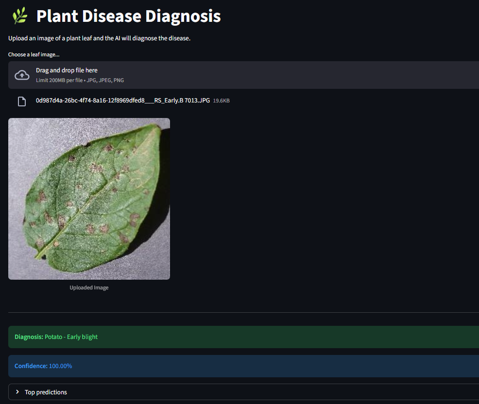

# Plant Disease Detection 🌿

This is an end-to-end computer vision project designed to identify 38 different plant disease classes from leaf images. It uses a deep learning model built with TensorFlow/Keras and provides a simple web interface for diagnosis.

This project was built to practice and showcase my skills in computer vision, particularly in:
* Transfer Learning and Fine-Tuning
* Data Augmentation
* Building and serving an end-to-end CV application

## Demo

Here is a look at the final Streamlit web application in action:




## Tech Stack

* **Python**
* **TensorFlow & Keras:** For building and training the deep learning model.
* **ResNet50V2:** As the pre-trained base model for transfer learning.
* **Streamlit:** For creating and serving the interactive web application.
* **Numpy & Matplotlib:** For data handling and visualization in the notebook.
* **Pillow (PIL):** For image processing in the web app.

## Project Structure
```bash
plant-disease-detection/
├── app.py                  # The Streamlit web application script
├── train_model.ipynb       # Jupyter Notebook with the full training process
├── plant_disease_model.keras # The final saved and trained model
├── requirements.txt        # A list of all necessary Python packages
├── class_names.json       # A list of all class names
├── data/                   # (Not uploaded) Folder for the original dataset
└── venv/                   # (Not uploaded) Virtual environment
```


## How to Run This Project

To run the web application on your local machine, follow these steps:

1.  **Clone the repository:**
    ```bash
    git clone [https://github.com/busebaser/plant-disease-detection.git](https://github.com/busebaser/plant-disease-detection.git)
    cd plant-disease-detection
    ```

2.  **Create and activate a virtual environment:**
    ```bash
    python -m venv venv
    # On Windows
    venv\Scripts\activate
    # On macOS/Linux
    source venv/bin/activate
    ```

3.  **Install the required packages:**
    ```bash
    pip install -r requirements.txt
    ```
    *(You will need to create this file by running `pip freeze > requirements.txt` in your activated virtual environment.)*

4.  **Run the Streamlit application:**
    ```bash
    streamlit run app.py
    ```

    This will open the application in your web browser.

## Methodology

The model was built and trained in the `train_model.ipynb` notebook. The key steps were:

1.  **Data Loading:** The [PlantVillage dataset](https://www.kaggle.com/datasets/emmarex/plantdisease/data) was loaded using `tf.keras.utils.image_dataset_from_directory`.
2.  **Data Augmentation:** A `Sequential` layer was used to apply random flips, rotations, and zooms to the training images to prevent overfitting.
3.  **Transfer Learning:** A pre-trained **ResNet50V2** model was used as the feature-extraction base. The base layers were frozen.
4.  **Initial Training:** A new classifier head (with `GlobalAveragePooling2D` and `Dense` layers) was added and trained on the dataset.
5.  **Fine-Tuning:** The top layers of the ResNet base were unfrozen, and the model was trained again with a very low learning rate to adapt the pre-trained features to this specific task.
6.  **Saving:** The final model was saved in the `.keras` format.
